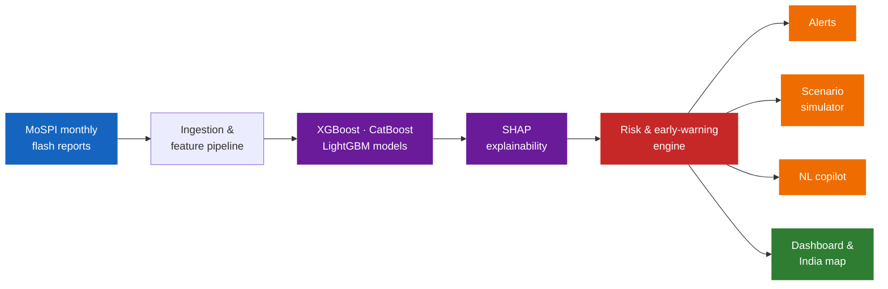
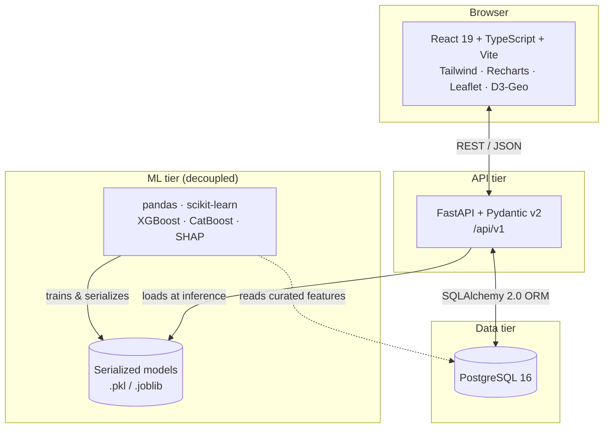
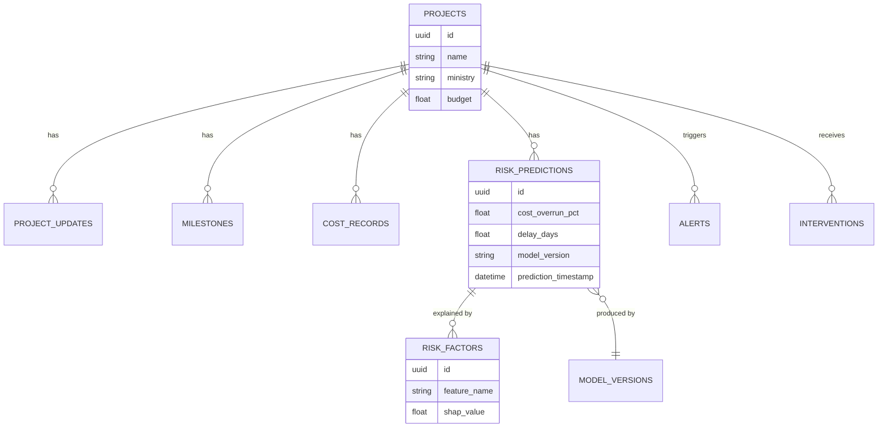

<div align="center">

# PARAM

### Predictive Analytics for Risk Attribution and Monitoring

Predicts cost overruns and schedule delays before they happen — explainably, at national scale.

[](https://sih.gov.in)
[]()
[]()

</div>

<br>

Infrastructure projects worth lakhs of crores run over budget and behind schedule, and by the time anyone notices on a spreadsheet, it's too late to course-correct. PARAM flags risk months in advance, explains why, and recommends what to do about it — across roughly 2,000 mega projects tracked nationwide, on 13 consecutive months of real MoSPI Flash Report data.

<br>

## How it works



<br>

## System architecture



The frontend never imports ML code directly — every prediction is served through the REST contract, keeping the three tiers independently deployable and testable.

<br>

## What it does

| Capability | What it means |
|---|---|
| Predicts | Cost overrun and time slippage per project, with calibrated confidence bounds |
| Explains | SHAP-based breakdown of exactly which factors drive each risk score |
| Alerts | Finite-state-machine early-warning engine, replacing manual spreadsheet triage |
| Simulates | What-if scenario engine to test cost, schedule, and labor levers before committing |
| Visualizes | Live India choropleth, sector and ministry benchmarks, 12-month trajectories |
| Converses | Natural-language copilot, grounded in real project data |
| Verifies | Satellite evidence, document intelligence, contractor delivery records |
| Reaches further | Offline field capture, bilingual voice input, escalation dispatch, PDF dossiers |

<br>

## Repository layout

```text
PARAM/
├── frontend/             React + TypeScript + Vite + Tailwind CSS dashboard shell
├── backend/              FastAPI + SQLAlchemy 2.0 + Alembic REST API backend
├── ml/                   Decoupled machine learning pipeline (SHAP, XGBoost, CatBoost)
├── data/
│   ├── raw/              Immutable raw ingestion files
│   ├── interim/          Standardized interim data
│   ├── processed/        Model-ready feature matrices
│   └── synthetic/        Explicitly tagged synthetic/demo datasets
├── notebooks/            Exploratory research notebooks
├── models/               Serialized model artifacts (.pkl, .joblib)
├── scripts/              Data generation and pipeline scripts
├── docs/                 Architectural specifications and diagrams
├── tests/                Monorepo architecture validation & integration tests
├── docker/               Dockerfiles and web server configurations
├── .env.example          Environment variable template
└── docker-compose.yml    Multi-container local orchestration
```

<br>

## Quick start

```bash
cp .env.example .env
docker-compose up --build
```

| Service | URL |
|---|---|
| Frontend | `http://localhost:3000` |
| API docs (Swagger) | `http://localhost:8000/api/v1/docs` |
| Health check | `http://localhost:8000/api/v1/health` |

<details>
<summary><strong>Run services individually, without Docker</strong></summary>

<br>

**Backend**

```bash
cd backend
python3 -m venv .venv && source .venv/bin/activate
pip install -r requirements.txt

alembic upgrade head
uvicorn app.main:app --reload --host 0.0.0.0 --port 8000
```

**Frontend**

```bash
cd frontend
npm install
npm run dev
```

Access the dev app at `http://localhost:3000` or `http://localhost:5173`.

</details>

<br>

## API surface (`/api/v1`)

| Method | Endpoint | Description |
|---|---|---|
| `GET` | `/health` | System health check & DB status |
| `GET` `POST` | `/projects` | List & create monitored projects |
| `GET` | `/projects/{id}` | Individual project detail |
| `GET` | `/monthly/*` | Multi-month trajectory aggregations |
| `GET` | `/analytics/*` | Overview, benchmarks, ministry, geography |
| `GET` | `/predictions/*` | Cost & schedule overrun risk exposures |
| `GET` | `/risks` | Risk indices & SHAP feature values |
| `GET` | `/alerts` | Active early-warning alerts feed |
| `POST` | `/scenarios/simulate` | What-if scenario impact simulation |
| `GET` `POST` | `/interventions/*` | Propose, review, approve risk mitigations |
| `POST` | `/copilot/query` | Database-grounded natural-language Q&A |

All endpoints above are live — none are mocked or placeholder.

<br>

## Database schema



```bash
cd backend
alembic revision --autogenerate -m "Add new features"
alembic upgrade head
```

<br>

## Testing & verification

```bash
# Backend + architecture validation
PYTHONPATH=.:backend .venv/bin/pytest backend/tests/ tests/

# Frontend build check
cd frontend && npm run build
```

<br>

## Tech stack

| Layer | Technologies |
|---|---|
| Frontend | React 19 · TypeScript (strict) · Vite · Tailwind CSS v4 · React Router v7 · TanStack Query v5 · Recharts · Leaflet · D3-Geo · i18next |
| Backend | Python 3.12+ · FastAPI · Pydantic v2 · SQLAlchemy 2.0 · Alembic |
| Database | PostgreSQL 16, with SQLite fallback for local unit tests |
| ML layer | pandas · numpy · scikit-learn · XGBoost · CatBoost · LightGBM · SHAP |
| Infrastructure | Docker · Docker Compose · Nginx |

<br>

## Architectural principles

1. **Strict decoupling** — the frontend communicates only via `/api/v1` REST contracts; no direct ML imports in React
2. **Reproducibility** — every prediction records its `model_version` and `prediction_timestamp`
3. **Immutable raw data** — `data/raw/` is never modified post-ingestion
4. **Data authenticity** — synthetic or mock data is always explicitly flagged `is_synthetic=True`

<br>

## Learn more

- [`docs/roadmap-implementation.md`](docs/roadmap-implementation.md) — intelligence workspace: document intelligence, commodity/climate twin, satellite evidence, calibrated bounds, offline capture, bilingual voice, PDF dossiers
- [`PAIMANA_STATUS_AND_INNOVATION_ROADMAP.md`](PAIMANA_STATUS_AND_INNOVATION_ROADMAP.md) — full platform audit & innovation roadmap
- [`docs/demo-script.md`](docs/demo-script.md) — demo walkthrough

<br>

<div align="center">
<sub>Built for Smart India Hackathon 2026</sub>
</div>
