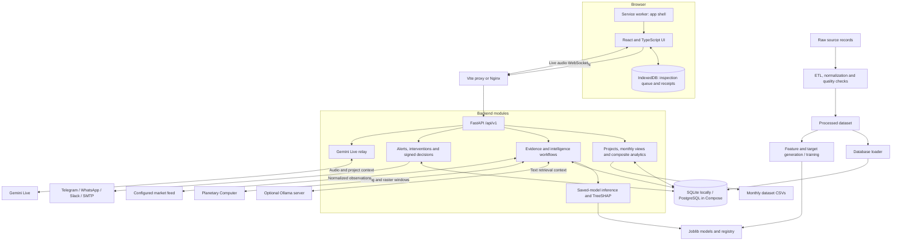
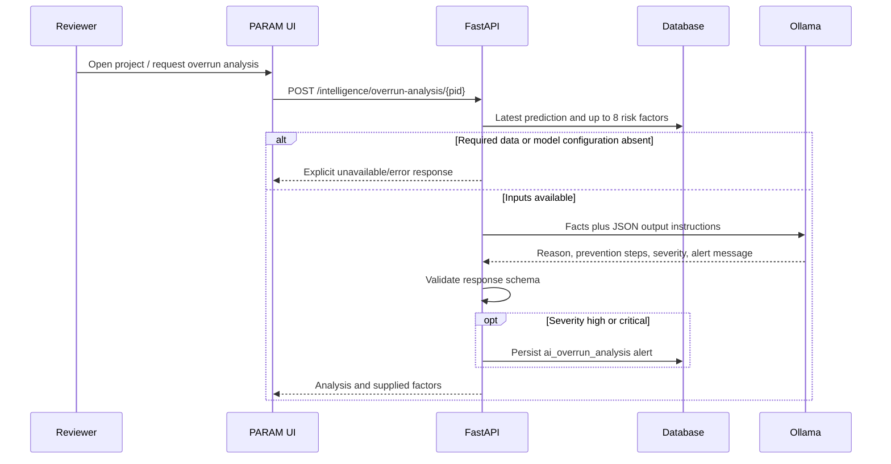
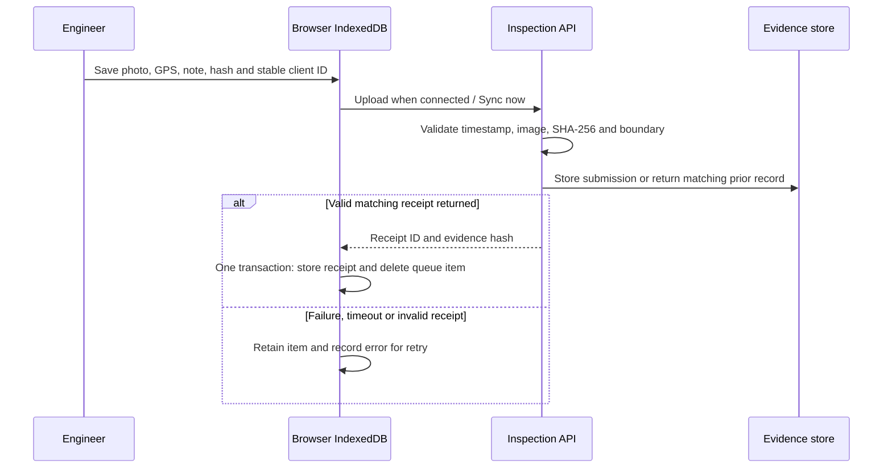
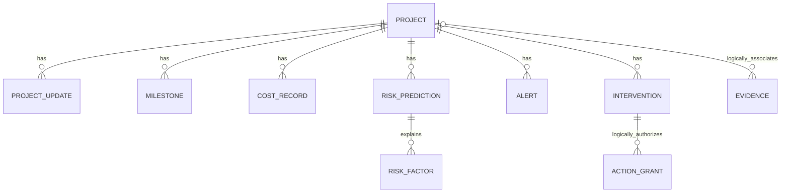

# PARAM

**Infrastructure monitoring, explainable risk assessment and evidence-backed project review.**

PARAM brings project financial records, monthly reporting, machine-learning outputs, documents, satellite observations and field inspections into one review workspace. It helps a reviewer move from **“which projects need attention?”** to **“what evidence supports this concern, and what action was recorded?”**

**PARAM is the name of this project.** PAIMANA refers to the government infrastructure-monitoring platform that provides the problem context. This repository retains historical `paimana` filenames, database names, internal model identifiers and some interface strings. Those compatibility names do not establish government affiliation, deployment or an official replacement relationship.

> **Implementation audit: 1 October 2026.** This README describes the current code, including limitations. Implemented workflows, available data and validated operational performance are different things. PARAM is a development/research implementation, not a certified government production service.

## Contents

- [Problem, users and novelty](#problem-users-and-novelty)
- [Features and navigation](#features-and-navigation)
- [Architecture](#architecture)
- [How the system works](#how-the-system-works)
- [Models, scoring and uncertainty](#models-scoring-and-uncertainty)
- [Evidence workflows](#evidence-workflows)
- [Data and persistence](#data-and-persistence)
- [Run locally](#run-locally)
- [Configuration](#configuration)
- [API and function documentation](#api-and-function-documentation)
- [Validation and operational limits](#validation-and-operational-limits)
- [Repository map](#repository-map)
- [Research and further reading](#research-and-further-reading)

## Problem, users and novelty

Infrastructure reviews need to distinguish reported expenditure, observed progress, model estimates, source evidence and human decisions. Financial growth alone does not explain a delay, a model output does not establish a cause, and an image change does not prove a milestone was completed. PARAM makes these different forms of information available in connected workflows.

| User / activity | What PARAM supports |
|---|---|
| Portfolio analyst | Filter projects, inspect monthly changes, compare cost exposure, schedule estimates, sectors and regions |
| Project reviewer | Inspect saved predictions, available feature attribution, source documents and recorded alerts |
| Field engineer | Capture photo/location evidence, retain it offline, synchronize and keep a receipt |
| Review authority | Record a decision, inspect delivery attempts and export a project dossier |
| ML / data engineer | Normalize records, build features and targets, train/evaluate artifacts and inspect provenance |

These are intended user activities, **not implemented login roles**. The current application does not provide a complete role-based identity system.

### What is distinctive about PARAM?

The contribution is the **integration of evidence, estimates and accountable review**, rather than a claim to have invented SHAP, conformal prediction, satellite indices or retrieval-augmented generation.

| Design contribution | Concrete implementation | Boundary of the claim |
|---|---|---|
| Connect financial warnings to multiple evidence sources | Project-linked documents, satellite comparisons, field receipts and review actions | There is no learned cross-modal evidence-fusion model or automatic causal proof |
| Make prediction provenance inspectable | Saved inputs, artifact hashes, model-version fingerprint and risk-factor attribution | Artifact identity does not certify training-data quality or forecast accuracy |
| Expose missing uncertainty evidence | Same-version held-out calibration required for delay intervals | Coverage assumptions require independent evaluation; a single-project guarantee is not offered |
| Retain field evidence through failed synchronization | IndexedDB queue, stable client IDs, atomic receipt storage/deletion, pause/resume and backup restore | No hardware-attested GPS and no guaranteed closed-app synchronization |
| Separate delivery from decision | Persistent dispatch attempts, signed expiring links, preview-only GET and explicit POST decision | Provider acceptance is not confirmed receipt; a bearer link is not identity verification |
| Offer local-language review and a local text LLM | Four UI languages, Ollama text analysis, optional browser speech and Gemini Live | Translation completeness, speech quality and generated explanations require acceptance testing |
| Make scenario assumptions visible | Sector material shares, remaining-spend fraction and rain-day productivity loss | This “twin” is a sensitivity calculator, not a physics-based construction simulator |

### Relationship to government PAIMANA

The government PAIMANA platform already includes monitoring, dashboards, reporting and integrations; those capabilities should not be presented as absent from it. NIC's October 2025 account describes the government platform and its direction toward advanced analytics. PARAM explores the specific workflows documented here, but this audit does **not** establish that they are globally novel or missing from every current government implementation. See the [official NIC description](https://informaticsweb.nic.in/article/infrastructure-project-monitoring-platform) and the [research and novelty assessment](docs/reference/research-and-novelty.md).

## Features and navigation

### Portfolio and project workspace

| Screen | Route | Functions |
|---|---|---|
| Dashboard | `/dashboard` | Backend summaries, selected-month aggregates, sector charts, trends and expanded chart views |
| Project register | `/projects` | Search, filters, sorting, pagination and links to individual projects |
| Project detail | `/projects/:id` | Financial metadata, history, risk assessment, Ollama overrun explanation and evidence-workspace shortcuts |
| Analytics | `/analytics` | Comparative analytics and navigation to cost/schedule views |
| Cost overrun | `/analytics/cost-overrun` | Composite estimates, exposure rankings, filters, charts and inline explanation panel |
| Time overrun | `/analytics/time-overrun` | Formula-derived delay estimates, severity, sorting and explanation panel |
| Benchmarks | `/benchmarks` | Sector/ministry/size/geography/stage/risk-group comparisons and sample-size disclosure |
| State progress | `/progress` | State-level summaries and geographic presentation |
| Risk and alerts | `/interventions` | Recorded alerts, named review/resolution, explicit action generation and intervention decisions |

`/alerts` redirects to interventions; `/map` redirects to state progress. `/copilot`, `/reports` and `/settings` redirect into Intelligence. `/scenarios` opens the cost/climate workflow. The index and unmatched routes return to Dashboard.

### Intelligence workspace

Use `/intelligence?tab=<tab>&project_id=<database-id>`. Project selection is explicit; the numeric database ID is not necessarily the government/source project code.

| Tab | Functions | Requirements |
|---|---|---|
| `documents` | PDF/text upload; SHA-256 deduplication; page extraction; cited passages; local retrieval or Ollama answer; portfolio filters; speech controls | Searchable document text; Ollama for generated text; permissions/providers for speech |
| `twin` | Steel/cement/bitumen/diesel shocks; rain/productivity buffer; project or portfolio totals; observation import/list; index comparison; configured feed refresh | Project budget, disclosed assumptions; compatible dated observations for index mode |
| `satellite` | STAC catalog search; imported band observations; optical raster computation; Sentinel-1 RTC computation; before/after imagery and discrepancy review | Surveyed polygon and suitable scenes; network; radar account key |
| `uncertainty` | Full-feature saved-model inference; attribution; calibration import; delay interval; completion dates; cohort survival/FY estimate | Model artifacts, all 18 features; independently sourced matching calibration/cohort data |
| `contractors` | Register delivery records; aggregate verified contractor identities across projects; on-time index; claims/payment/delay indicators | Sourced identity and project records; at least three projects for a score |
| `field` | Photo/GPS capture; offline queue; retries, pause/resume, backup/restore and receipts; boundary registration; connected milestones/progress entry | Supported browser storage/camera/location; server boundary; online connection for connected forms |
| `dispatch` | Select intervention/channel; explicit send; inspect persistent delivery audit | Approved recipient, configured adapter, HTTPS public API URL and signing key |
| `reports` | Download a project PDF dossier | Existing project and its available evidence |
| `settings` | Inspect configuration readiness; store operator key for the browser session | Actual connectivity must be checked separately |

Interface languages: English, Hindi, Tamil and Bengali. Project names, imported documents, raw JSON and some runtime messages can remain in their original language. Selecting a language does not translate the underlying dataset.

## Architecture

PARAM is a **modular monolith**: one React application, one FastAPI service, relational storage and a separate set of Python data/ML tools. The diagram shows logical boundaries; these are not independently deployed microservices.



**Important storage boundary:** Monthly charts can read CSVs directly while other views query SQL tables. Updating the database alone does not refresh all historical charts. There is no automatically scheduled ingestion/training daemon started by the web application.

### Technology stack

| Layer | Current implementation |
|---|---|
| Web | React 19, TypeScript, Vite 8, Tailwind 4, React Router 7, TanStack Query, Recharts, geographic rendering and i18next |
| Browser persistence | Service Worker Cache API, IndexedDB and a locally cached project directory |
| API | FastAPI, Pydantic v2 validation, SQLAlchemy 2, Alembic, HTTPX and WebSockets |
| Database | Default local `backend/paimana.db` SQLite; PostgreSQL 16 configuration in Compose |
| Modeling | pandas, NumPy, scikit-learn, XGBoost, CatBoost, LightGBM, SHAP and lifelines |
| Documents / imagery | pypdf, ReportLab, Pillow and rasterio |
| Text / audio AI | Ollama for text planning/answers/overrun explanations; Gemini Live for optional audio |
| Deployment | Python 3.12 container, Node 22 build container, Nginx and Docker Compose |

Package versions in [frontend/package.json](frontend/package.json) and the Python requirement files are the source of truth. Python dependencies use lower bounds rather than a fully locked environment.

## How the system works

### 1. Source records become usable project information

1. `backend/app/data_pipeline/ingestion.py` reads supported raw files and validates schema.
2. Normalization standardizes IDs, numeric fields, dates and ordering.
3. Quality checks identify duplicates, missingness and anomalies, and write a report.
4. Derived features and leakage checks produce CSV/Parquet analytical data.
5. `load_projects_from_dataframe()` upserts project metadata by external project ID and creates/updates composite prediction records.
6. Monthly APIs separately parse ministry/sector/state/physical-progress files for the coded reporting window.

The loader updates an existing prediction row in some cases; it is not an append-only historical forecast ledger. Training and ingestion scripts may overwrite generated reports or artifacts. Use a controlled dataset/output location when experimenting.

### 2. Reviewers inspect a project and ask for an explanation



This is a separate operation from executing the numerical models. LLM severity is generated text classification; it is not an independently calibrated risk probability. Repeated successful high/critical requests can create additional alerts. The explanation response is returned to the UI; the entire narrative is not stored as a versioned evidence artifact by this endpoint.

### 3. Field evidence survives an interrupted upload



Exact retries use the same client ID. A different payload with that ID is rejected; duplicate photo bytes within a project are also rejected. Backups contain sensitive photographs and coordinates. Browser storage is not a centrally managed backup service.

### 4. A warning becomes a recorded decision

An explicit action-generation request evaluates stored risk/exposure. A reviewer can put an action under review, approve or reject it. Final decisions resist replay. Optional dispatch creates a persistent attempt and a signed, 24-hour, single-use decision link. GET displays the review; POST claims the grant and updates the intervention in one transaction. A process crash around delivery can still leave an ambiguous attempt, so the application does not claim exactly-once external delivery.

The older trajectory engine has an in-memory state/cooldown mechanism and can return a computed alert from the project-trajectory endpoint. That is **different from** the persistent alerts used by the intelligence workflow; do not assume every computed trajectory warning is written to the database.

## Models, scoring and uncertainty

### Three distinct model/data paths

| Path | Entry point | Meaning |
|---|---|---|
| Composite portfolio estimates | `/predictions/cost-overrun`, `/predictions/time-overrun`, loader and monthly scoring | Deterministic financial/sector formula; not a trained CatBoost forecast |
| Saved tree-model inference | `POST /intelligence/model/predict` | Actual serialized models, strict 18-feature API input, saved predictions and attribution |
| Snapshot baseline experiment | `scripts/train_cost_overrun_model.py` | Logistic regression / ridge baseline on snapshot financial records; separate from the tree inference endpoint |

The model registry lists metadata and a report-derived baseline entry when available. Its `deployed` label checks artifact presence, not that the production API uses that model or that it meets an accuracy threshold.

### Composite risk calculation

Implemented in [risk_scoring.py](backend/app/services/risk_scoring.py):

```text
cost_growth_pct = max(0, 100 × (revised_cost - original_cost) / original_cost)
expenditure_ratio_pct = 100 × cumulative_expenditure / original_cost
R_cost = clip(0.60 × cost_growth_pct / 50
              + 0.40 × max(0, (expenditure_ratio_pct - 70) / 60), 0, 1)
R_delay = clip(estimated_delay_days / 547, 0, 1)
R_scale = clip((log10(max(10, original_cost)) - 1) / 3, 0, 1)
R_overall = clip(0.50 × R_cost + 0.35 × R_delay + 0.15 × R_scale, 0, 1)
```

The implementation handles zero/missing original budgets and substitutes the original cost for a nonpositive revised cost. Delay is a formula using hardcoded sector baselines, cost growth and expenditure ratio. These constants are implementation assumptions; source comments alone do not establish empirical calibration. Reported cost growth is based on revised cost, not an observed future final outturn.

Composite bands are Low `<0.25`, Moderate `0.25–<0.50`, High `0.50–<0.75`, Critical `≥0.75`. Other workflows use different thresholds: the local query phrase “high risk” means `≥0.60`, and action generation considers `≥0.40` when higher-tier criteria do not apply. Do not present these thresholds as one uniform classification system.

### Saved models and input features

The inference loader selects XGBoost cost regression (random forest regression fallback), a saved random-forest cost classifier, XGBoost delay regression and CatBoost risk regression. All four required roles must be present. The API rejects missing/extra feature keys and nonfinite values. It does not comprehensively validate the engineering plausibility of every supplied number.

| Feature | Interpretation / unit |
|---|---|
| `project_original_budget_cr` | Original budget, INR crore |
| `project_planned_duration_days` | Baseline duration, days |
| `sector_historical_overrun_avg` | Historical sector cost-overrun percentage |
| `sector_historical_delay_avg_months` | Historical sector delay, months |
| `ministry_active_projects_count` | Active project count |
| `ministry_avg_completion_rate` | Ministry completion fraction |
| `cost_expenditure_ratio` | Expenditure as a percentage of original budget (×100) |
| `cost_acceleration_mom` | Change in the implemented month-to-month cost measure |
| `schedule_remaining_days` | Remaining baseline days |
| `schedule_elapsed_pct` | Elapsed fraction of planned time, expressed as percentage |
| `progress_physical_pct` | Reported physical progress, percentage |
| `progress_gap_pct` | Elapsed-time percentage minus physical-progress percentage |
| `progress_velocity_mom` | Month-to-month progress change |
| `progress_trend_3m`, `progress_trend_6m` | Implemented rolling progress slopes |
| `milestone_slippage_rate` | Fraction of applicable milestones slipping |
| `temporal_project_age_months` | Age at observation, months |
| `historical_contractor_delay_score` | Historical contractor-delay measure |

Consult the [feature implementation](ml/features/feature_engineering.py) and [feature registry](docs/feature-registry.md) before supplying inputs; names alone do not establish compatible units. The general Python predictor retains optional defaults, while the HTTP inference route enforces complete inputs.

Each inference persists a `risk_predictions` row and a `model_input` evidence record with input features and SHA-256 hashes of top-level model files. Its version includes an artifact fingerprint. The fingerprint currently includes all top-level `.joblib` files, including ones not selected for inference.

CatBoost TreeSHAP supplies a base value and feature contributions for the risk model's raw output. The final risk may be clipped to `[0,1]`; attribution describes the unclipped output. Attribution failure is returned as unavailable. SHAP explains model behavior, not project causation. See [SHAP's TreeExplainer documentation](https://shap.readthedocs.io/en/latest/generated/shap.TreeExplainer.html).

**Probability distinction:** `delay_probability` is currently `clip(predicted_delay_days / 365, 0, 1)`, a severity normalization. It is not a calibrated probability of delay or completion. Legacy fixed confidence fields remain null until the separate evidence workflow supports a result.

### Training, evaluation and uncertainty

- `ml/models/trainer.py` builds features/targets and compares tree models. It uses fixed chronological boundaries, falling back to the last three available dates when needed. Verify project overlap, target dates and source quality before interpreting metrics.
- `scripts/train_cost_overrun_model.py` is a different snapshot baseline with a random split; it cannot demonstrate longitudinal forecasting when source dates are absent.
- `scripts/train_baselines.py` includes baseline experiments, including survival artifacts. Their existence does not mean the current UI executes Cox-PH inference.
- `ml/features/leakage_detector.py` and target-time assertions support checks but cannot certify real-world independence by themselves.
- The delay calibration API accepts at least nine declared held-out pairs for the same model version. For residuals `|actual − predicted|`, it uses rank `ceil((n+1) × 0.9)` and a symmetric interval, truncated below at zero. Valid marginal coverage relies on appropriate exchangeability assumptions; this is not an individual guarantee. [Conformal prediction reference](https://arxiv.org/abs/2107.07511).
- The API accepts cost calibration records too, but the current uncertainty endpoint consumes **delay** calibration only.
- The completion curve is Kaplan–Meier over supplied event/censoring records. Conditional FY-end estimates are withheld beyond observed follow-up or without required dates. They describe a cohort, not a personalized completion probability. [Kaplan–Meier reference](https://lifelines.readthedocs.io/en/latest/fitters/univariate/KaplanMeierFitter.html).

## Evidence workflows

### Document intelligence and local LLM

1. Upload PDF or UTF-8 text under a project. The browser limits uploads to 8 MB; the backend imposes its own size/page limits.
2. Extract page text with pypdf; store the hash, source name, pages and original PDF bytes in JSON evidence.
3. Chunk text with overlap, rank by query-token overlap and return up to five passages with source/page information.
4. Retrieve the selected project or up to 30 portfolio records, ordered by recorded risk.
5. With `OLLAMA_MODEL` configured, ask Ollama to answer from these facts; otherwise return local retrieval summaries.

This is a lexical retrieval pipeline, not a vector database, embedding search or trained reranker. The current `/ask` route does not send stored PDFs to a multimodal model, and no OCR service is wired into it. Scanned files with no extractable text remain insufficient for text retrieval. Older roadmap descriptions of Gemini multimodal document generation are superseded by this code path.

Portfolio planning accepts allowlisted states, sectors, ministries and minimum risk/overrun/delay filters. Optional Ollama output is validated against that schema and the database catalog; model-generated SQL is never executed. Retrieved documents are untrusted context. Prompt instructions and structured validation reduce some failure modes but do not prove every generated claim is grounded. [Ollama chat API](https://docs.ollama.com/api/chat).

### Commodity and climate scenarios

```text
incremental cost = remaining budget fraction × project budget
                   × sum(material share × material price shock / 100)
schedule buffer days = rain days × productivity-loss fraction
```

Material shares are illustrative road/rail/power/default configurations. Weights need not sum to one because only selected components are shocked. Observation-based comparisons require matching geography and increasing dates; compatible index bases still depend on the supplied source data. The normalized HTTPS feed is configured by the operator; there is no automatically connected government WPI or IMD feed.

### Satellite change and review

The code uses a fixed Planetary Computer STAC provider, restricted raster asset hosts, signed asset access, bounded 256×256 raster windows and a registered polygon. Optical comparisons mask clouds and compare common usable pixels. NDVI is `(NIR − red)/(NIR + red)`; NDBI is `(SWIR − NIR)/(SWIR + NIR)`. Sensor scaling and Sentinel-2 processing offsets are handled in the adapter. [Copernicus processing reference](https://sentiwiki.copernicus.eu/web/s2-processing).

A claimed progress increase of at least 15 points with NDBI change below 0.02 can request review when quality requirements are met. Raster areas larger than 0.3 degrees in either dimension are rejected; corridors must be divided into smaller inspection areas. SAR comparison uses provider terrain-corrected Sentinel-1 RTC power, compatible acquisition geometry/polarization and dB/power change. It does not implement local SAR terrain correction. [RTC collection specification](https://planetarycomputer.microsoft.com/api/stac/v1/collections/sentinel-1-rtc).

These thresholds are review heuristics, not validated construction classifiers. Seasonality, flooding, bare soil, scene alignment and project type can confound change. “No threshold breach” does not mean independently verified completion.

### Contractor delivery records

InfraScore keeps the latest record for each contractor/project pair, then aggregates by supplied contractor ID:

- On-time index: `100 × total on-time milestones / total milestones`.
- Claims rate: `1000 × total arbitration claims / total work value in crore`.
- Payment days: mean of supplied non-null project values.
- Critical packages: count with delay strictly above 180 days.
- Score: rounded on-time index only when at least three distinct projects exist.

Identity/source fields are operator-supplied; there is no independent contractor identity-verification service. The score is not a credit model, exclusion recommendation or multi-factor blacklist.

### Field evidence and voice

The PWA caches its shell and retains inspection records in IndexedDB. It requires a prior online load and a secure browser context for relevant device features. The inspection API verifies image format/size, hash, timestamp, declared GPS accuracy and point-in-polygon location. It does not attest device location/time or distinguish authentic site photos from staged photographs. [IndexedDB](https://developer.mozilla.org/en-US/docs/Web/API/IndexedDB_API) and [Service Worker](https://developer.mozilla.org/en-US/docs/Web/API/Service_Worker_API) references explain the browser foundations.

Browser dictation/speech synthesis are separate from Gemini Live. Live audio travels through the backend WebSocket relay, keeping provider credentials off the client. The application limits sessions to ten minutes and handles transcripts/playback interruption. This integration sends selected project context to the external provider. [Gemini Live protocol](https://ai.google.dev/api/live).

### Escalation policy

| Tier | Implemented trigger |
|---|---|
| 3 | Recorded overrun exposure **> INR 500 crore**, or latest predicted delay **> 180 days** |
| 2 | Three consecutive months, same model version, risk rising at both month-to-month transitions |
| 1 | Project-level review when higher-tier evidence is absent |

Generation skips tier-1 projects below recorded risk 0.40 and avoids another `evidence_review` action for a project that already has one, even after its prior action is final. This is not a complete recurring intervention lifecycle. Telegram supports tier-specific recipient overrides; other adapters use their configured recipients. There is no built-in official PMO/PRAGATI connection.

## Data and persistence

### Logical entity relationships



The last two are **logical associations**: evidence project IDs and grant intervention IDs currently are not declared database foreign keys. Model registry entries live in a `model_versions` table and JSON/artifact files, with no enforced FK from prediction-version strings.

| Table | Purpose |
|---|---|
| `projects` | Metadata, external IDs, financial values, stored composite risk |
| `project_updates`, `milestones`, `cost_records` | Progress observations, planned/actual milestone dates and expenditure records |
| `risk_predictions`, `risk_factors` | Saved estimates, versions and optional attribution rows |
| `alerts`, `interventions` | Persistent warnings and review actions |
| `model_versions` | Training/deployment metadata, not live model health |
| `intelligence_evidence` | JSON records for documents, market observations, boundaries, satellite evidence, calibration, contractors, inspections, dispatch, decisions and model inputs |
| `intelligence_action_grants` | Token identity, intervention, expiry and consumed state |

Photos/PDF bytes can be stored base64-encoded in evidence JSON. There is no object-storage lifecycle, tenant isolation, archive policy or automatic sensitive-data redaction implemented here.

### Audited local snapshot

Read-only inspection on **1 October 2026** found 1,776 projects and 1,776 predictions in the default backend SQLite file; all projects used `composite_multidimensional_v2` and predictions used `composite_v2.0`. There were **zero risk-factor rows**, two evidence records (one document and one satellite record), 398 interventions and zero alerts. This describes the checked local file, not a deployment benchmark, verified national coverage or a guarantee about another checkout. Evidence contents were not independently authenticated.

Top-level tree-model artifacts were present locally, but their presence does not mean every project has run through that inference path. Ignored/generated model files may be absent in a fresh clone.

The monthly code has a fixed **July 2025–July 2026** window and treats July 2026 as “latest.” Earlier ministry files can be sector summaries while later files are project-level. Missing project-level history must not be presented as 13 complete observations for every project.

## Run locally

### Prerequisites

- Python 3.12+ with compatible wheels for the ML/geospatial dependencies; the container targets 3.12.
- Node.js 22.12+ is a suitable baseline for the current Vite/plugin stack; the container uses Node 22.
- npm and an isolated Python virtual environment.
- Optional: Ollama, Docker Compose, provider accounts and sourced evidence.

Run commands from the repository root unless specified otherwise. Existing model/data files may already be present; no training or data reload is required simply to inspect a populated local dashboard.

### 1. Install dependencies

```bash
python3 -m venv .venv
.venv/bin/python -m pip install -r backend/requirements.txt -r ml/requirements.txt
cd frontend
npm ci
cd ..
```

### 2. Select local configuration

Do not blindly copy the PostgreSQL container URL from `.env.example` when running outside Docker. For the built-in SQLite default, leave `DATABASE_URL` unset in both the process and applicable `.env` files. To select another database, export an explicit absolute SQLite URL or accessible PostgreSQL URL.

```bash
export PROJECT_NAME=PARAM
export ENVIRONMENT=development
# Optional explicit database selection:
# export DATABASE_URL=sqlite:////absolute/path/to/param.db
```

`backend/app/config.py` explicitly loads **`backend/.env`**; Pydantic also reads `.env` relative to the working directory. Provider adapters use `os.getenv`, so for predictable behavior put backend/provider settings in `backend/.env` or export them. Do not rely on a root-only `.env` populating every adapter setting. Existing process variables take precedence over the explicit dotenv load.

### 3. Start the backend

```bash
PYTHONPATH=backend:. .venv/bin/python -m uvicorn app.main:app --host 127.0.0.1 --port 8000
```

The application calls `create_all()` on startup regardless of environment; it creates missing tables but does not perform schema migration. For a new empty Alembic-managed database, configure the same `DATABASE_URL` and run:

```bash
cd backend
../.venv/bin/alembic upgrade head
cd ..
```

Do not run initial migrations against an already populated, unversioned database without reconciling its baseline. Revisions 0004/0005 add evidence/grants and reconcile historical schema differences; downgrade of reconciliation intentionally retains columns.

### 4. Start the frontend

```bash
cd frontend
npm run dev
```

- Frontend: `http://localhost:3000` (Vite can choose another port if occupied; check its output).
- API docs: `http://127.0.0.1:8000/api/v1/docs`.
- OpenAPI: `http://127.0.0.1:8000/api/v1/openapi.json`.
- Health response: `http://127.0.0.1:8000/api/v1/health` — currently a static schema response, not a real database probe.

Vite proxies `/api`, including WebSockets, to port 8000. For a backend on port 8001:

```bash
PAIMANA_BACKEND_URL=http://127.0.0.1:8001 npm run dev
```

Prefer the default relative `/api/v1` client base. If overriding `VITE_API_BASE_URL`, define it in Vite's environment/build context, not only the repository root.

### 5. Use a production build for PWA checks

```bash
cd frontend
npm run build
npm run preview -- --host 127.0.0.1 --port 4173
```

Visit the app and field workspace online first. A phone needs an accessible HTTPS endpoint; its own `localhost` is not your development computer. Test actual airplane-mode reload, storage permissions, capture and reconnect before claiming device acceptance.

### Optional Docker Compose

```bash
docker compose up --build
```

The checked Compose file maps frontend `3000:80`, backend `8000:8000` and PostgreSQL `5432:5432`. It uses development credentials/configuration and has not been validated as a hardened production deployment. Inject provider variables into the backend explicitly; Compose does not automatically forward arbitrary host `.env` entries. The frontend is static after build, so setting `VITE_*` only on its running Nginx container does not rebuild JavaScript.

Some report/model paths are relative to the process working directory; the backend container starts in `/app/backend` while inference resolves its main models from the repository root. Check report visibility separately. Ollama on the host is not reachable as `localhost` from inside a container without a suitable network address.

### Data import and training

Inspect the source/schema before a data refresh. The following explicit loader uses the active `app` package consistently and writes project/prediction records:

```bash
PYTHONPATH=backend:. .venv/bin/python - <<'PY'
from app.data_pipeline.runner import run_etl_pipeline
from app.data_pipeline.db_loader import load_projects_from_dataframe
from app.database import SessionLocal
frame, output = run_etl_pipeline()
with SessionLocal() as db:
    count = load_projects_from_dataframe(db, frame)
print(count, output)
PY
```

Back up the intended database before a deliberate reload. `scripts/load_real_dataset.py` contains mixed `backend.app`/`app` imports; it is a legacy entry point and is not the recommended command above.

Training entry points, for compatible and sufficiently complete datasets:

```bash
PYTHONPATH=backend:. .venv/bin/python -m ml.models.trainer
PYTHONPATH=backend:. .venv/bin/python scripts/train_cost_overrun_model.py
PYTHONPATH=backend:. .venv/bin/python scripts/train_baselines.py
```

These are different experiments, not three required steps in one pipeline. Do not train timeline models from an undated snapshot or interpret synthetic-fixture performance as real deployment evidence. Detailed definitions and caveats are in the [research assessment](docs/reference/research-and-novelty.md).

## Configuration

| Setting | Consumer / purpose |
|---|---|
| `PROJECT_NAME`, `ENVIRONMENT`, `DATABASE_URL` | Backend metadata, operator policy and database selection |
| `API_V1_STR` | API prefix; `.env.example` currently uses the different name `API_V1_PREFIX`, which does not configure this field |
| `PAIMANA_BACKEND_URL` | Legacy-named Vite proxy target |
| `VITE_API_BASE_URL` | Frontend API base, evaluated at build/dev time |
| `OPERATOR_API_KEY` | Shared `X-Operator-Key` for selected writes and AI requests; browser stores it in sessionStorage |
| `OLLAMA_BASE_URL`, `OLLAMA_MODEL` | Query planning, text answers and overrun analysis; choose an actually installed model |
| `GEMINI_API_KEY`, `GEMINI_LIVE_MODEL` | Separate optional live audio service; `GEMINI_MODEL` is not used by current text `/ask` |
| `PC_SDK_SUBSCRIPTION_KEY` | Sentinel-1 RTC access in this implementation |
| `MARKET_FEED_URL`, `MARKET_FEED_TOKEN` | Approved HTTPS normalized observation feed, optional bearer token |
| `ACTION_SIGNING_KEY` | Stable secret of at least 32 characters for signed decisions |
| `PUBLIC_API_URL` | External HTTPS API base, e.g. `https://example.org/api/v1` |
| `TELEGRAM_BOT_TOKEN`, `TELEGRAM_CHAT_ID` | Telegram; optional `TELEGRAM_CHAT_ID_TIER_1/2/3` overrides |
| `WHATSAPP_TOKEN`, `WHATSAPP_PHONE_ID`, `WHATSAPP_TO`, `WHATSAPP_GRAPH_VERSION` | WhatsApp adapter; account/message-policy compatibility needs separate verification |
| `SLACK_WEBHOOK_URL` | Slack incoming webhook |
| `SMTP_HOST`, `SMTP_PORT`, `SMTP_FROM`, `SMTP_USER`, `SMTP_PASSWORD`, `ALERT_EMAIL_TO` | STARTTLS email adapter |

Do not put provider secrets in `VITE_*`, which is client-side configuration. An absent Ollama model permits local retrieval; a configured but unreachable model returns an error. Readiness status is based on configuration presence, not a full network/model health check.

Scheduled escalation defaults to read-only candidate output:

```bash
.venv/bin/python scripts/dispatch_escalations.py --channel telegram
```

`--send` explicitly generates eligible actions and attempts delivery. Only schedule it with authorized recipients and a reviewed operational policy; application startup does not enable it.

## API and function documentation

- [Complete API route reference](docs/reference/api-reference.md): every registered application route, handler, route-level access condition and behavior notes.
- [Function and module index](docs/reference/function-index.md): every named Python function/method and named frontend function discovered in the audited source scope, linked to implementation; stubs flagged explicitly.
- [Research, novelty and evaluation plan](docs/reference/research-and-novelty.md): primary sources, methodological limits, improvement priorities and testable research questions.
- [Seven-minute PARAM narration](docs/demo/PARAM_VIDEO_SCRIPT.md).

Example read/calculation requests (replace project ID if absent in your database):

```bash
curl http://127.0.0.1:8000/api/v1/intelligence/projects
curl http://127.0.0.1:8000/api/v1/intelligence/uncertainty/1
curl -X POST http://127.0.0.1:8000/api/v1/intelligence/twin \
  -H 'Content-Type: application/json' \
  -d '{"project_id":1,"steel":10,"remaining_fraction":0.5,"rain_days":5,"productivity_loss":0.5}'
```

Use OpenAPI for the exact request schema. API response envelopes differ across older and newer routes; some return bare arrays, others `{status,data}`, and intelligence endpoints usually return direct objects.

## Validation and operational limits

### Reproducible checks

```bash
PYTHONPATH=backend:. .venv/bin/python -m pytest backend/tests tests -q
cd frontend
npm test
npm run typecheck
npm run build
npm run lint
```

Some Python tests retrain models and rewrite generated files/reports. Run them in an isolated checkout or inspect resulting changes before using production artifacts. Tests of provider interactions use mocks unless explicitly described otherwise.

The earlier implementation guide records **111 Python tests and 7 offline-queue tests passing on 25 September 2026**, plus build/lint and local HTTP/PDF checks. Those are dated results; the current source has since changed. This documentation audit checked source structure, database counts, links and generated references; it does not reassert those historic test counts as a fresh full regression run. Real browser/device behavior, provider accounts and production infrastructure require their own acceptance evidence.

### Known boundaries and improvement priorities

| Area | Current limitation / next engineering work |
|---|---|
| Authentication | No full user identity, tenant boundary or RBAC. Operator gating is selective; legacy project creation and many reads are not protected by it. Signed links grant bearer authority. |
| Security/deployment | Wildcard CORS with credentials, automatic table creation, development Compose secrets and no app-wide rate limiting; harden before exposing sensitive project evidence. |
| Health | `/health` returns defaults without a real DB query; integration status reports configuration, not availability. |
| Data freshness | Hardcoded reporting months; no government live-feed contract or automatic refresh established. Some readers combine CSV and SQL sources. |
| Numerical interpretation | Composite estimates, learned predictions and normalized severity are not interchangeable; thresholds differ between views/workflows. The legacy `/predictions` summary returns fixed 14.5% / 42-day values when no valid project resolves. Do not use that fallback as evidence. |
| Source integrity | Imported source/held-out/identity assertions are not independently verified. Hashes protect byte consistency, not truthfulness. |
| Model quality | No independently reproduced current prospective accuracy/coverage evidence is claimed. Historical generated metrics require dataset/provenance review. |
| Retrieval | Lexical matching, limited passages/portfolio rows, no OCR/vector retrieval, no per-document access controls or citation-entailment validator. |
| AI latency | UI request timeout is generally 60 seconds while Ollama analysis may wait 90 seconds; client timeout does not guarantee server work or alert creation was canceled. |
| Scale | Synchronous model loading, raster work and provider calls; JSON/base64 evidence storage and unpaginated evidence reads need workload testing and resource controls. |
| Offline/device | Storage quota/eviction and permissions vary; no guaranteed background sync, trusted capture hardware or encrypted offline vault. |
| Workflow lifecycle | Generated project review actions are deduplicated permanently by type/project; recurrent reviews and richer assignment/closure workflows need design. |
| Legacy scaffolding | Several `ml/` abstraction classes raise `NotImplementedError`; older scenario/copilot services have illustrative defaults and are not current routed implementations. |
| Branding/UI | Internal PAIMANA names remain. The legacy client derives some risk sub-scores from overall risk, returns empty/default values on fetch failure, and retains a static state-summary helper. These are not independent measurements. A complete product rename/visual audit is separate from this documentation update. |

## Repository map

```text
README.md                         Project overview, architecture and setup
frontend/src/pages/               Portfolio, project and Intelligence screens
frontend/src/components/          Layout, charts, overrun panel, field records, voice
frontend/src/lib/inspectionQueue.ts Offline evidence and receipt transactions
frontend/src/i18n/                English / Hindi / Tamil / Bengali resources
frontend/public/                 Manifest, service worker, audio worklet and icon
backend/app/api/v1/               HTTP and WebSocket route handlers
backend/app/services/             Scoring, evidence calculations, EO, query planning
backend/app/data_pipeline/        Ingestion, normalization, quality, features, DB load
backend/app/models/              SQLAlchemy entities and evidence/grant tables
backend/alembic/                  Schema migration history
ml/features/                     Features, targets and leakage checks
ml/models/                       Training, predictors, calibration and registry
ml/explainability/               SHAP support and example output
models/                          Local artifacts and JSON registry
scripts/                         Loading, baseline training and scheduled dispatch
backend/tests/, tests/            API, data, model and architecture tests
frontend/tests/                  IndexedDB queue/recovery tests
data/                            Raw, monthly, interim and processed records
docs/reference/                  API/function reference and research assessment
docs/demo/                       PARAM narration script
docker/, docker-compose.yml      Development container topology
```

## Research and further reading

The [research assessment](docs/reference/research-and-novelty.md) links the primary sources used on 1 October 2026 and maps each to actual code behavior. It also proposes evaluations for predictive skill, interval coverage, document grounding, satellite discrepancies, offline recovery and operator utility.

Earlier design documents remain useful for intent: [feature registry](docs/feature-registry.md), [ML problem definition](docs/ml-problem-definition.md), [data dictionary](docs/data-dictionary.md), [early-warning design](docs/early-warning-system.md) and [implementation history](docs/roadmap-implementation.md). They may contain older names or aspirational claims. Current code and this audited overview take precedence when they disagree.
