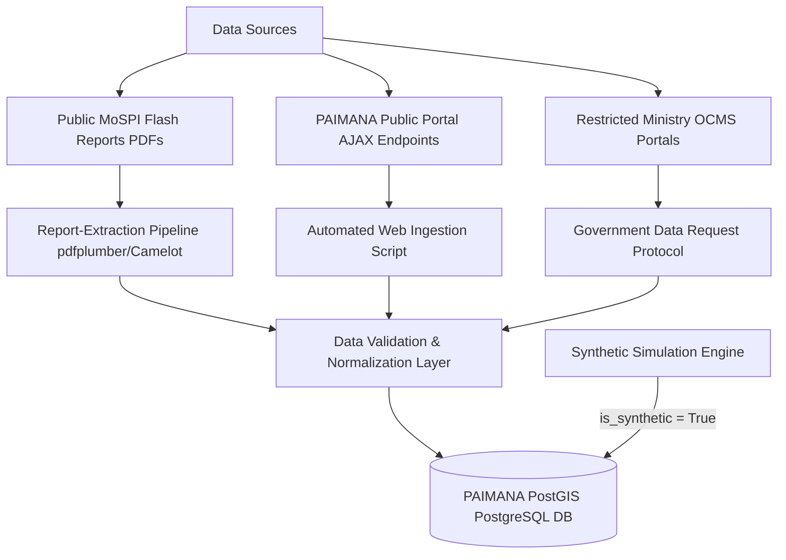

# Data Acquisition & Ingestion Plan: PAIMANA PredictIQ

> **Platform**: PAIMANA Infrastructure Monitoring Platform  
> **Role**: Data Research Lead, SIH 26103  
> **Status**: Verified Operational Plan  

---

## 1. Data Strategy Overview

The data acquisition strategy for PAIMANA PredictIQ balances **official government data extraction**, **structured PDF parsing of historical publications**, **formal credential requests for restricted endpoints**, and **rigorous synthetic data simulation** for prototype validation.



---

## 2. Acquisition Tiers & Access Protocols

### Tier 1: Immediate Collection (No Barrier Access)
- **Source**: MoSPI IPMD Monthly Flash Reports (Public PDF archive spanning 2015–2026).
- **Extracted Attributes**: `project_id`, `project_name`, `ministry_name`, `sector`, `original_cost`, `revised_cost`, `cumulative_expenditure`, `original_completion_date`, `revised_completion_date`, `delay_reasons_category`.
- **Method**: Automated HTTP downloader + HTML/PDF table parser.
- **Frequency**: Monthly execution matching MoSPI publication cycles.

### Tier 2: Government Access Required (Authenticated / Formal API)
- **Source**: PAIMANA Authenticated Gateway (`https://paimana-proj.mospi.gov.in/User/Login`) and legacy OCMS database backups.
- **Extracted Attributes**: Milestone-level target vs. actual dates (`milestone_name`, `milestone_target_date`, `milestone_actual_date`), granular PIU narrative issue logs, contractor assignment history.
- **Protocol**:
  1. Submit formal data request under SIH 2026 guidelines to Ministry of Statistics & Programme Implementation (IPMD Division).
  2. Request read-only staging API keys or monthly anonymized database dumps (`.csv` / `.parquet`).
  3. Establish secure OAuth2 bearer token authentication pipeline for production ingestion.

---

## 3. PDF Report-Extraction Pipeline Design

Because historical project observations are predominantly distributed via formatted PDF Flash Reports, a specialized report-extraction pipeline is architected:

```text
[MoSPI PDF Reports] 
       │
       ▼
 1. Layout Analysis & Table Boundary Detection (Camelot-py / pdfplumber)
       │
       ▼
 2. Text Normalization & Clean-up (Regex scrubbing for currency & date formats)
       │
       ▼
 3. Schema Validation (Pydantic models verifying numerical ranges)
       │
       ▼
 4. Reconciliation (Cross-checking cumulative expenditure against revised cost)
       │
       ▼
[PostgreSQL Database / Interim Parquet Storage]
```

### Extraction Pipeline Implementation Specification
- **Tools**: `camelot-py` (lattice mode for bordered tables), `pdfplumber` (text positioning), `pandas` (data transformation).
- **Regex Scrubbing**:
  - Currency values: Remove commas, currency symbols (`₹`, `Rs.`), convert `Lakh` / `Crore` strings into float INR Crores.
  - Date strings: Parse ambiguous formats (`MMM-YYYY`, `DD/MM/YYYY`, `Q3 FY25`) into standard ISO `YYYY-MM-DD`.
- **Accuracy & Confidence Limitations**:
  - Optical / alignment errors in scanned PDF pages may yield a ~3–5% missing cell rate.
  - Textual delay remarks vary in phrasing across different ministries; NLP categorization required.

---

## 4. Synthetic Data Generation Protocol

To enable robust prototype development, stress testing, and machine learning training prior to receiving full government database authorization, a synthetic generation pipeline is established.

### Principles of Synthetic Data Generation
1. **Explicit Tagging**: Every simulated row in `projects` and `project_updates` MUST have `is_synthetic = True`.
2. **Domain-Constrained Distributions**:
   - Project budgets modeled using log-normal distribution matching historical Indian Central Sector project statistics ($\mu = 5.8, \sigma = 1.2$, capped at ₹150 Cr minimum).
   - Cost overrun percentages modeled using Weibull/Gamma distributions with long-tail characteristics (mean overrun ~18-25%).
   - Time delays correlated with financial expenditure velocity and sector complexity (e.g., Railways & Metro projects exhibiting higher delay variance than Solar Power).
3. **Data Integrity Rules**:
   - `cumulative_expenditure` monotonically increases across monthly updates.
   - `revised_cost` $\ge$ `original_cost`.
   - `revised_completion_date` $\ge$ `original_completion_date`.

---

## 5. Data Limitations & Constraints Risk Log

| Limitation | Technical Impact | Mitigation / Workaround |
|---|---|---|
| **Lack of Monthly Milestone Data in Public PDFs** | Intermediate progress velocity cannot be measured at sub-project level from PDF summaries alone. | Use `physical_progress_pct` linear interpolation and simulate milestone breakdown in synthetic tier. |
| **PDF Formatting Shift Across Years** | Layout shifts between 2018 and 2024 cause table extraction parser failures. | Maintain layout version mapping registry in `scripts/extract_flash_reports.py`. |
| **Missing Contractor / Vendor Identity** | Cannot evaluate contractor risk features directly from public Flash Reports. | Request restricted access credentials; use sector-average contractor risk proxies in prototype. |
| **Reporting Lag (30–60 Days)** | Monthly Flash Reports represent data 1-2 months prior to publication date. | Incorporate lag timestamps (`reporting_lag_days`) into time-series feature engineering. |
