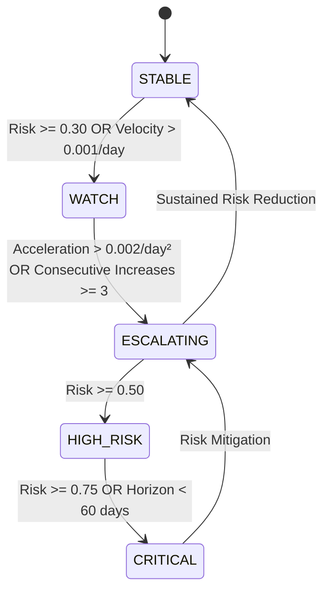

# Early Warning & Risk Trajectory System Architecture

> **System**: PAIMANA PredictIQ — Proactive Infrastructure Risk Detection  
> **Module**: `app.services.early_warning_engine`  
> **Author**: Backend Engineer (SIH 26103)  

---

## 1. Executive Summary & Objective

Traditional project monitoring platforms only flag projects *after* they cross critical failure thresholds. **PAIMANA PredictIQ's Early Warning Engine** identifies risk **acceleration**—detecting projects moving along deteriorating trajectories (e.g. Risk $40 \rightarrow 45 \rightarrow 51 \rightarrow 63 \rightarrow 76$) before critical failure materializes.

---

## 2. Finite State Machine (FSM)

The system manages 5 operational risk states:

### State Definitions & Rationale
1. **`STABLE`**: Baseline operational state ($\text{Risk} < 0.30$, low velocity).
2. **`WATCH`**: Emerging risk signal ($\text{Risk} \in [0.30, 0.50]$ or consecutive risk increases $\ge 2$).
3. **`ESCALATING`**: High risk acceleration ($\text{Acceleration} > 0.002/\text{day}^2$ or consecutive risk increases $\ge 3$).
4. **`HIGH_RISK`**: Elevated risk baseline ($\text{Risk} \in [0.50, 0.75]$).
5. **`CRITICAL`**: Immediate threat of severe overrun ($\text{Risk} \ge 0.75$ or expected failure horizon $< 60$ days).

---

## 3. Mathematical Risk Trajectory Metrics

For any time-series of project risk observations $[(t_0, R_0), (t_1, R_1), \dots, (t_n, R_n)]$:

| Metric Name | Mathematical Formula | Description |
|---|---|---|
| **Current Risk** | $R_n$ | Latest predicted risk score |
| **Previous Risk** | $R_{n-1}$ | Prior period predicted risk score |
| **Risk Delta** | $\Delta R = R_n - R_{n-1}$ | Absolute score change |
| **Risk Velocity** | $v_n = \frac{R_n - R_{n-1}}{\Delta t}$ | Daily rate of risk change |
| **Risk Acceleration** | $a_n = \frac{v_n - v_{n-1}}{\Delta t}$ | Second derivative (change in velocity) |
| **Consecutive Deterioration** | Count of consecutive $R_k > R_{k-1}$ | Duration of uninterrupted deterioration |
| **Warning Persistence** | $\Delta t_{\text{elevated}}$ | Days spent in non-STABLE states |
| **Expected Failure Horizon** | $H = \frac{0.75 - R_n}{\max(0.0001, v_n)}$ | Estimated days until Critical threshold |
| **Early Warning Lead Time** | $T_{\text{lead}} = t_n - t_{\text{first\_warning}}$ | Advance lead time provided to stakeholders |

---

## 4. Alert Prioritization & Cooldown Deduplication

### Prioritization Formula
Alerts are sorted by a multi-factor priority score rather than raw risk score alone:

$$\text{Priority Score} = \text{Risk Score} \times \text{Project Potential Impact Weight} \times \text{Urgency Factor}$$

- **Urgency Factor**:
  - $3.0$ if Horizon $\le 30$ days
  - $2.0$ if Horizon $\le 90$ days
  - $1.0$ otherwise

### Cooldown & Suppression Logic
To prevent alert fatigue:
- Duplicate alerts of the same `alert_type` for a project are suppressed within a **7-day cooldown window**.
- **Escalation Bypass**: If an alert escalates to `CRITICAL` severity, the cooldown window is immediately bypassed to ensure urgent notification.

---

## 5. API Endpoints Contract

### `GET /api/v1/alerts`
Query parameters: `project_id`, `severity` (`LOW`, `MEDIUM`, `HIGH`, `CRITICAL`), `state`.

### `GET /api/v1/projects/{id}/risk-trajectory`
Returns complete historical observations, 9 trajectory metrics, state machine state, and active alerts.
