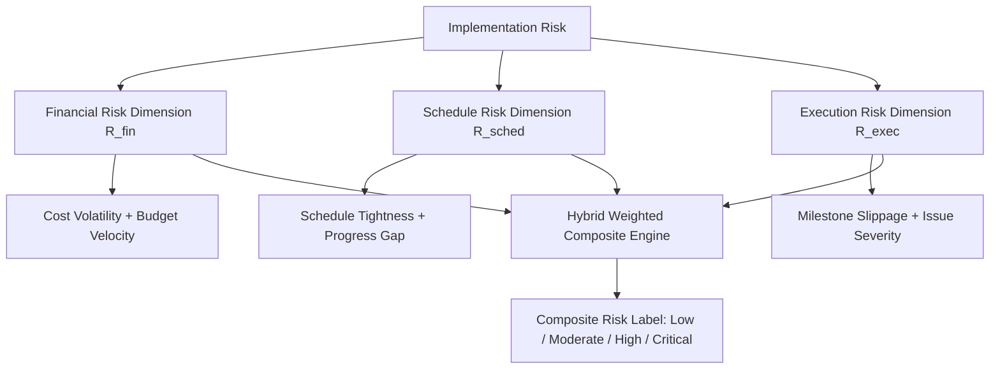

# PAIMANA PredictIQ: ML Problem Formulation & Target Specification

> **Role**: Machine Learning Engineer (Infrastructure Risk & Predictive Modeling)  
> **System**: PAIMANA PredictIQ — MoSPI Central Sector Infrastructure Monitoring  
> **Document Version**: 1.0.0 (Canonical Machine Learning Problem Definition)  

---

## 1. Executive Summary

**PAIMANA PredictIQ** is designed as a multi-target, time-aware predictive machine learning platform for infrastructure project monitoring under the Ministry of Statistics and Programme Implementation (MoSPI), Government of India. 

Infrastructure monitoring presents unique predictive challenges: projects evolve over multi-year horizons, reporting data is updated periodically (monthly snapshots), and baseline expectations shift when formal revisions are sanctioned. To serve executive decision-makers effectively, the ML architecture must predict **cost overruns**, **schedule delays**, and **composite implementation risk**, while generating **early-warning alerts** at least 60 to 90 days before risks materialize.

```text
========================================================================================
TIMELINE BOUNDARY (Prediction Timestamp T)
----------------------------------------------------------------------------------------
HISTORICAL FEATURE WINDOW (-∞, T]             │ TARGET EVALUATION WINDOW (T, T_final]
All observed progress, costs, milestones,     │ Final cost overrun, final schedule delay,
and lag velocity computed HERE ONLY.          │ and composite risk evaluated HERE ONLY.
========================================================================================
```

---

## 2. Target Variable Definitions & Mathematical Formulations

To ensure absolute rigor and eliminate baseline ambiguity, all target variables are defined relative to explicit reference baselines.

### 2.1 Baseline Selection & Switching Logic

#### Cost Baseline Selection Logic
1. **Original Approved Cost ($C_{\text{approved}}$)**: The initial CCEA / Ministry sanctioned budget (in ₹ Crore). This serves as the **primary immutable baseline** for measuring true government expenditure escalation and macroeconomic project viability.
2. **Latest Revised Cost ($C_{\text{revised}}$)**: The formally approved or anticipated revised budget (in ₹ Crore).
3. **Switching Rule & Rationale**:
   - For public policy, executive reporting, and national cost overrun predictions, **$C_{\text{approved}}$ is the canonical baseline**.
   - If evaluating operational performance *post-formal revision*, the baseline switches to $C_{\text{revised}}$, but the revision flag `has_cost_revision = True` and penalty multiplier are recorded.

#### Time Baseline Selection Logic
1. **Original Target Completion Date ($D_{\text{original}}$)**: Sanctioned commissioning date at project launch.
2. **Latest Revised Target Date ($D_{\text{revised}}$)**: Current anticipated completion date reported by the Project Implementation Unit (PIU).
3. **Switching Rule & Rationale**:
   - **$D_{\text{original}}$ is the canonical baseline** for overall time overrun calculation.
   - For short-term monthly operational slippage, delay velocity is measured relative to $D_{\text{revised}}$ to detect secondary delays beyond approved extensions.

---

### 2.2 Cost Overrun Targets

#### Target 1A: Continuous Cost Overrun Percentage (`continuous_cost_overrun_percentage`)
- **Definition**: The percentage cost escalation at project completion (or final evaluation timestamp $T_{\text{final}}$) relative to original approved cost $C_{\text{approved}}$.
- **Mathematical Formula**:
  $$\text{cost\_overrun\_pct} = \frac{C_{\text{final}} - C_{\text{approved}}}{C_{\text{approved}}} \times 100$$
  *Where $C_{\text{final}}$ is the total actual cost incurred at project completion.*

#### Target 1B: Binary Cost Overrun Flag (`binary_cost_overrun`)
- **Definition**: Binary classification target indicating whether project cost overrun exceeds a material government threshold of $5\%$ over original budget.
- **Mathematical Formula**:
  $$\text{binary\_cost\_overrun} = \begin{cases} 1 & \text{if } \frac{C_{\text{final}} - C_{\text{approved}}}{C_{\text{approved}}} > 0.05 \\ 0 & \text{otherwise} \end{cases}$$

---

### 2.3 Time Overrun Targets

#### Target 2A: Continuous Delay Duration (`continuous_delay_duration`)
- **Definition**: Total schedule delay measured in days (or months) beyond the original planned completion date $D_{\text{original}}$.
- **Mathematical Formula**:
  $$\text{delay\_duration\_days} = \max\left(0, \text{DateDiff}_{\text{days}}(D_{\text{actual\_end}}, D_{\text{original}})\right)$$

#### Target 2B: Binary Time Overrun Flag (`binary_time_overrun`)
- **Definition**: Binary classification target indicating whether schedule delay exceeds 90 days (1 quarter).
- **Mathematical Formula**:
  $$\text{binary\_time\_overrun} = \begin{cases} 1 & \text{if } \text{delay\_duration\_days} > 90 \\ 0 & \text{otherwise} \end{cases}$$

---

## 3. Implementation Risk Framework

The **PAIMANA Implementation Risk Framework** decouples risk into three domain-grounded dimensions, aggregating them into a unified risk label.



### 3.1 Risk Dimensions

1. **Financial Risk ($R_{\text{fin}} \in [0, 1]$)**:
   - Measures budget volatility, cost acceleration, and expenditure-to-progress imbalance.
   - Formula: $R_{\text{fin}} = 0.6 \times \min\left(1.0, \frac{\text{cost\_growth\_pct}}{50}\right) + 0.4 \times \max\left(0.0, \frac{\text{expenditure\_ratio} - \text{progress\_pct}}{50}\right)$

2. **Schedule Risk ($R_{\text{sched}} \in [0, 1]$)**:
   - Measures schedule tightness, progress gap velocity, and delay duration ratio.
   - Formula: $R_{\text{sched}} = 0.5 \times \min\left(1.0, \frac{\text{delay\_days}}{365}\right) + 0.5 \times \max\left(0.0, \frac{\text{progress\_gap}}{40}\right)$

3. **Execution Risk ($R_{\text{exec}} \in [0, 1]$)**:
   - Measures milestone slippage rate and severity of reported delay bottlenecks (e.g., land acquisition, environmental clearances).
   - Formula: $R_{\text{exec}} = 0.6 \times \text{milestone\_slippage\_rate} + 0.4 \times \text{issue\_severity\_score}$

### 3.2 Aggregation Method & Rationale

- **Chosen Approach**: **D. Hybrid Weighted Composite with Threshold Multipliers**.
- **Business Rationale**: Pure model-derived risk labels lack transparency for government audit (MoSPI/CAG), while pure unweighted averages fail to capture critical financial overruns. 
- **Composite Formula**:
  $$R_{\text{composite}} = 0.40 \times R_{\text{fin}} + 0.35 \times R_{\text{sched}} + 0.25 \times R_{\text{exec}}$$
- **Risk Category Mapping**:
  - `Low`: $R_{\text{composite}} < 0.25$
  - `Moderate`: $0.25 \le R_{\text{composite}} < 0.50$
  - `High`: $0.50 \le R_{\text{composite}} < 0.75$
  - `Critical`: $R_{\text{composite}} \ge 0.75$

---

## 4. Temporal Formulation & Target Leakage Prevention

### 4.1 Strict Temporal Boundary Rules
1. **Prediction Timestamp ($T$)**: The monthly snapshot date (e.g., `2026-04-01`).
2. **Feature Information Horizon**: For any prediction at time $T$, feature input vector $X_T$ MUST contain data recorded on or before $T$ ($t \le T$).
3. **Target Information Horizon**: Target variables $Y_T$ evaluate events occurring strictly after $T$ ($t > T$), typically at project completion $T_{\text{final}}$.

### 4.2 Minimum Lead Time Constraint
- **Rule**: Predictions are valid only if generated at least **60 days prior** to the scheduled or actual completion date ($T \le D_{\text{planned}} - 60 \text{ days}$). Predictions generated $< 60$ days before completion are flagged as post-hoc assessments.

---

## 5. Early-Warning Prediction Mechanism

The early-warning mechanism identifies trajectory anomalies before formal budget or schedule revisions are requested.

### Leading Indicators
1. **Progress Velocity Deceleration ($\Delta \text{Progress} / \Delta t$)**: 3-month rolling velocity dropping below $0.5\%$ per month.
2. **Burn Rate Acceleration**: Monthly expenditure increasing while physical progress remains flat (indicating rework or unbilled overheads).
3. **Milestone Slippage Density**: Consecutive missed milestone targets within a 60-day window.

### Prediction Output Format
- **Early-Warning Risk Score ($[0.0, 1.0]$)**.
- **Calibrated 95% Confidence Interval ($[\text{Lower}, \text{Upper}]$)** via Quantile Regression / Conformal Prediction.
- **Alert Triggers**:
  - `AMBER ALERT`: Risk Score $\ge 0.60$ or 60-day velocity drop $> 30\%$.
  - `RED ALERT`: Risk Score $\ge 0.80$ or simultaneous cost & time risk $> 0.75$.
