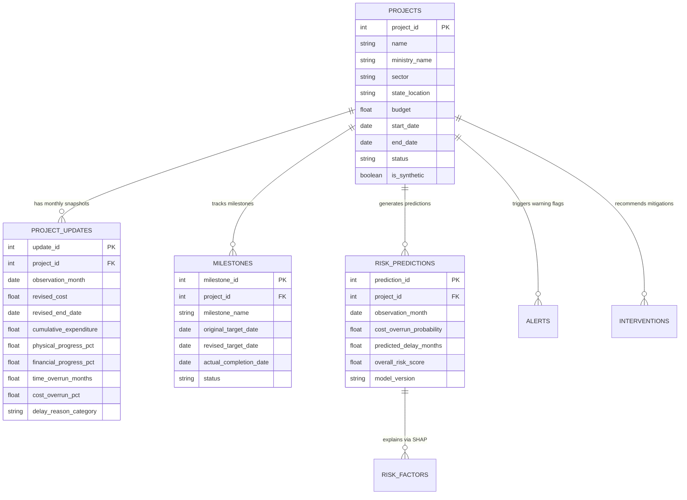

# Recommended Canonical Schema & Task Requirement Matrix

> **Platform**: PAIMANA PredictIQ Machine Learning & Analytics Engine  
> **Role**: Data Research Lead, SIH 26103  
> **Status**: Approved Canonical Schema Specification  

---

## 1. Relational Entity Architecture

The canonical PAIMANA schema is designed around a relational, time-series backbone. It decouples static project properties from dynamic monthly observations, milestone progress logs, and AI prediction audit entries.

---

## 2. Minimum Dataset Requirements Matrix per Task

The table below defines the dataset requirements for each key machine learning prediction task within the PAIMANA PredictIQ platform:

### 2.1 Task Requirements Table

| Task Name | Task Goal & Model Type | Essential Fields (Mandatory) | Useful Fields (Accuracy Enhancers) | Unavailable Fields (Workaround / Proxy) |
|---|---|---|---|---|
| **1. Cost Overrun Prediction** | Binary classification / regression predicting likelihood and magnitude of cost overrun ($>10\%$). | `budget` (original cost), `revised_cost`, `cumulative_expenditure`, `sector`, `project_age_months`, `physical_progress_pct` | `ministry_name`, `state_location`, `delay_reason_category`, `budget_allocation_annual` | `contractor_bid_variance` (Use sector average cost variance as proxy) |
| **2. Time Overrun Prediction** | Regression estimating delay duration in months beyond baseline schedule. | `start_date`, `end_date` (original), `revised_end_date`, `physical_progress_pct`, `project_age_months` | `milestone_target_date`, `milestone_actual_date`, `delay_reason_category`, `sector` | `real_time_weather_delay_index` (Use regional seasonal delay indices) |
| **3. Implementation Risk Scoring** | Multi-class scoring assigning low / moderate / high / critical risk tiers. | `cost_overrun_pct`, `time_overrun_months`, `physical_progress_pct`, `financial_progress_pct`, `delay_reason_category` | `cumulative_expenditure`, `ministry_name`, `milestone_status_ratio` | `contractor_financial_health_score` (Simulate via synthetic tier) |
| **4. Early Warning Signal Flags** | Binary classification detecting sudden velocity drops or cost acceleration before official revision. | `monthly_expenditure_delta`, `physical_progress_velocity` ($\Delta\% / \Delta t$), `observation_month` | `delay_reason_category`, `milestone_missed_count` | `daily_site_worker_count` (Use monthly physical progress velocity) |
| **5. Risk Trajectory Estimation** | Forecasting risk score evolution over 3, 6, and 12-month horizon. | Time series sequence of `cost_overrun_pct`, `time_overrun_months`, `physical_progress_pct` over past 6+ months | `sector_growth_rate`, `annual_budget_release_pattern` | `macroeconomic_commodity_price_futures` (Use historical sector inflation rate) |
| **6. What-If Scenario Simulation** | Counterfactual estimation of risk score under parameter variation (e.g. $+20\%$ budget, $+6$ months delay). | `budget`, `revised_cost`, `project_age_months`, `physical_progress_pct`, `sector` | `delay_reason_category`, `financial_progress_pct` | `supplier_contract_penalty_clauses` (Use standardized percentage slider inputs) |

---

## 3. Detailed Field Mapping per Task

### 1. Cost Overrun Prediction
- **Essential**: `original_cost`, `revised_cost`, `cumulative_expenditure`, `physical_progress_pct`, `sector`, `project_age_months`.
- **Useful**: `ministry_name`, `state_location`, `delay_reason_category`.
- **Unavailable / Synthetic**: `contractor_credit_score`, `raw_material_inflation_index`.

### 2. Time Overrun Prediction
- **Essential**: `start_date`, `original_completion_date`, `revised_completion_date`, `physical_progress_pct`, `project_age_months`.
- **Useful**: `sector`, `state_location`, `delay_reason_category`, `milestone_completion_rate`.
- **Unavailable / Synthetic**: `land_acquisition_dispute_court_cases`.

### 3. Implementation Risk Scoring
- **Essential**: `cost_overrun_pct`, `time_overrun_months`, `physical_progress_pct`, `financial_progress_pct`.
- **Useful**: `delay_reason_category`, `sector`, `ministry_name`.
- **Unavailable / Synthetic**: `contractor_performance_audit_score`.

### 4. Early Warning Signals
- **Essential**: $\Delta \text{Expenditure}$, $\Delta \text{Physical Progress}$, `observation_month`.
- **Useful**: `delay_reason_category`, `sector`.
- **Unavailable / Synthetic**: `drone_imagery_coverage_pct`.

### 5. Risk Trajectory Estimation
- **Essential**: Sequential lag features $t-1, t-2, \dots, t-6$ of `cost_overrun_pct`, `time_overrun_months`, `physical_progress_pct`.
- **Useful**: `sector_average_delay_rate`.
- **Unavailable / Synthetic**: `global_supply_chain_disruption_index`.

### 6. What-If Scenario Simulation
- **Essential**: User-adjusted baseline values for `budget`, `completion_date`, `sector_type`.
- **Useful**: Sensitivity parameters ($\alpha_{\text{cost}}, \beta_{\text{delay}}$).
- **Unavailable / Synthetic**: N/A (Direct mathematical function of trained model feature space).
