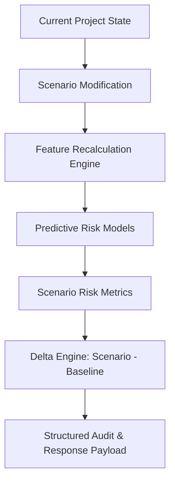

# What-If Risk Scenario Simulation Engine Architecture

> **System**: PAIMANA PredictIQ — What-If Decision Simulation Layer  
> **Module**: `app.services.scenario_engine`  
> **Author**: Backend Engineer (SIH 26103)  

---

## 1. Core Architectural Objective

The **What-If Scenario Simulation Engine** enables government decision-makers to evaluate hypothetical project disruptions and intervention options (e.g. *"What if structural concrete works are delayed by 3 months?"* or *"What if expenditure slows down by 20%?"*).

---

## 2. End-to-End Data Flow



---

## 3. Supported Scenario Types

The engine supports 8 standard scenario types plus custom parameter inputs:

1. **`SCHEDULE_DELAY_1M`**: +1 Month schedule delay (+30 days).
2. **`SCHEDULE_DELAY_3M`**: +3 Months schedule delay (+90 days).
3. **`SCHEDULE_DELAY_6M`**: +6 Months schedule delay (+180 days).
4. **`EXPENDITURE_SLOWDOWN`**: -20% Expenditure velocity change.
5. **`PROGRESS_SLOWDOWN`**: -15% Physical progress velocity drop.
6. **`COST_INCREASE`**: +10% Budget / cost overrun increase.
7. **`PROGRESS_IMPROVEMENT`**: +15% Physical progress velocity acceleration.
8. **`SCHEDULE_RECOVERY`**: -60 Days schedule recovery via fast-tracking.
9. **`CUSTOM`**: Custom user-defined parameter overrides.

---

## 4. Non-Certainty & Model Assumption Disclaimers

To maintain scientific rigor:
Every simulation response includes an explicit audit disclaimer:

> **NOTICE**: *Projections represent model risk predictions calculated strictly under user-specified scenario assumptions and DO NOT constitute guaranteed real-world outcomes or causal proof.*

---

## 5. API Response Schema & Worked Example

### Endpoint: `POST /api/v1/scenarios/simulate`

#### Sample Request Body:
```json
{
  "project_id": "P101",
  "scenario_type": "SCHEDULE_DELAY_3M",
  "simulated_by": "Shri_RK_Sharma"
}
```

#### Sample Response Body:
```json
{
  "status": "success",
  "message": "What-if scenario simulation executed successfully",
  "data": {
    "project_id": "P101",
    "scenario_type": "SCHEDULE_DELAY_3M",
    "audit_trail": {
      "scenario_id": "SCEN_P101_1756800000",
      "timestamp": "2026-09-02T21:49:23Z",
      "simulated_by": "Shri_RK_Sharma",
      "assumptions_disclaimer": "NOTICE: Projections represent model risk predictions calculated strictly under user-specified scenario assumptions and DO NOT constitute guaranteed real-world outcomes or causal proof."
    },
    "assumptions": {
      "scenario_type": "SCHEDULE_DELAY_3M",
      "duration_delta_days": 90
    },
    "baseline": {
      "cost_risk": 0.285,
      "delay_risk": 0.48,
      "overall_risk": 0.3728,
      "predicted_delay_duration_days": 108.0,
      "predicted_cost_overrun_pct": 9.15
    },
    "scenario": {
      "cost_risk": 0.285,
      "delay_risk": 0.7875,
      "overall_risk": 0.5414,
      "predicted_delay_duration_days": 237.2,
      "predicted_cost_overrun_pct": 9.15
    },
    "delta": {
      "risk_change": 0.1686,
      "estimated_delay_days": 129.2,
      "estimated_cost_exposure_pct": 0.0,
      "is_risk_escalated": true
    }
  }
}
```
